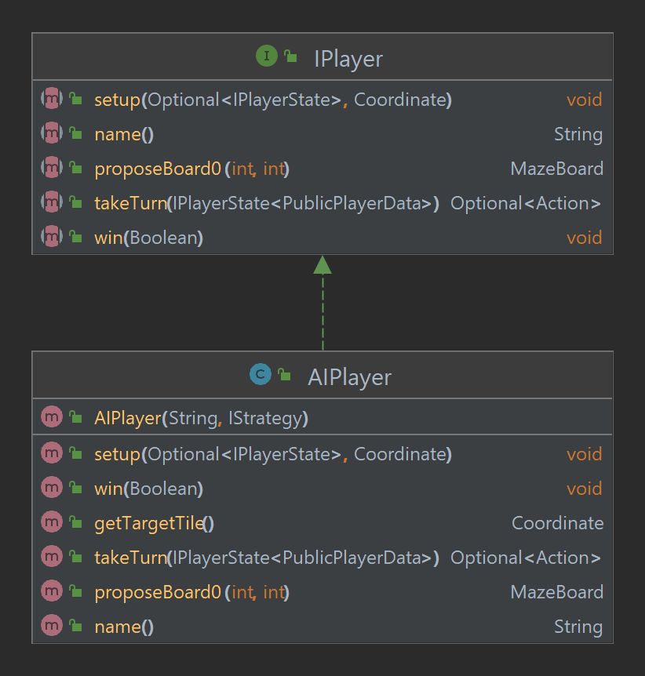

## Player

The player represents the player programming interface used by the referee to communicate with a player.

### Classes

`IPlayerState`: An interface containing the methods that a referee can call on the player.

`AIPlayer`: A concrete class that implements the IPlayerState interface. It implements a
the `takeTurn` method that calls the `getMove` method of the `IStrategy` interface.

