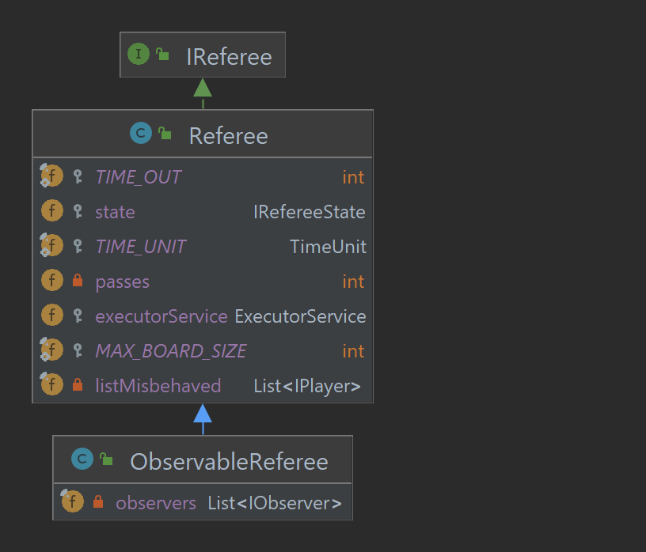

## Referee

The referee is the main class that controls the game. It is responsible for
creating the state if necessary, running a game to completion, and interacting with players according to the 
logical interaction protocol. 

