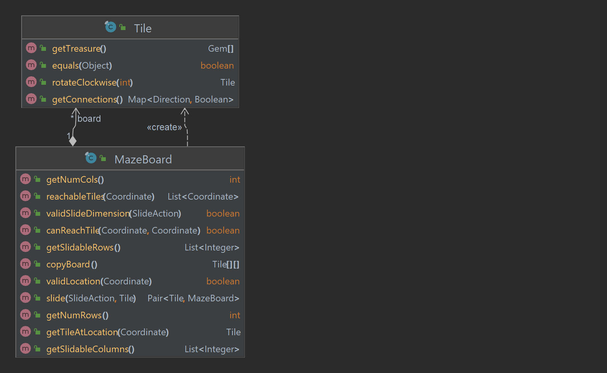

## Data representation for the board of Labyrinth.

### Board

A Board is a 2D array of Tile connectors

Main operations that a Maze Board offers:

- Slide
- All reachable tiles from a starting point
- Whether there is a path from point A to B.

### Tile

Tiles is an object with two fields:

- Treasures: Array of two Gem
- Connector: Map<Direction, Boolean> represents if a direction has a connector.

Main operation that a tile offers

- Rotation

