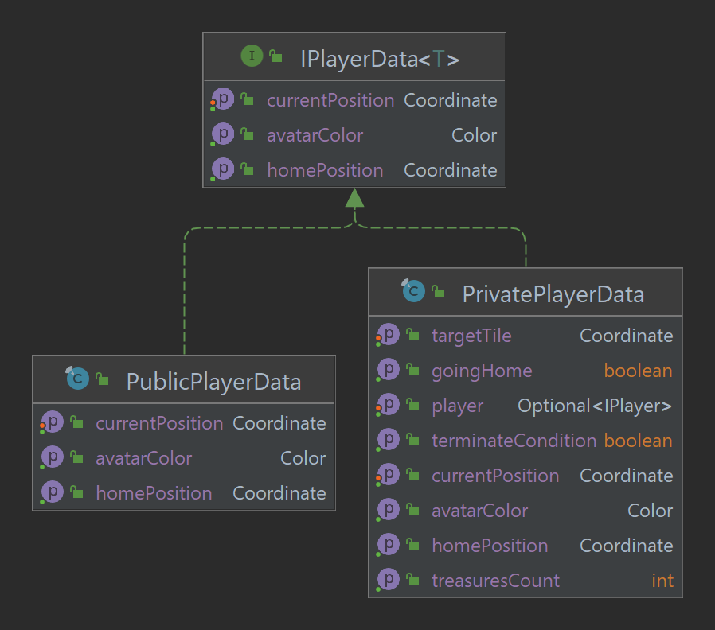

## Game State

### Private vs Public Knowledge of a player

- Public information available of a player is their current position and home tile.
- Private information available of a player is their target tile and isGoing home tracker.

### RefereeState vs PlayerState

- A RefereeState represents the state of the game, containing all information and methods public and private.
    - A queue of private player information provides knowledge of all target tiles
    - A referee state has a queue of candidate tiles.

- A PlayerState represents the state will all information that would be publicly available to a player.

