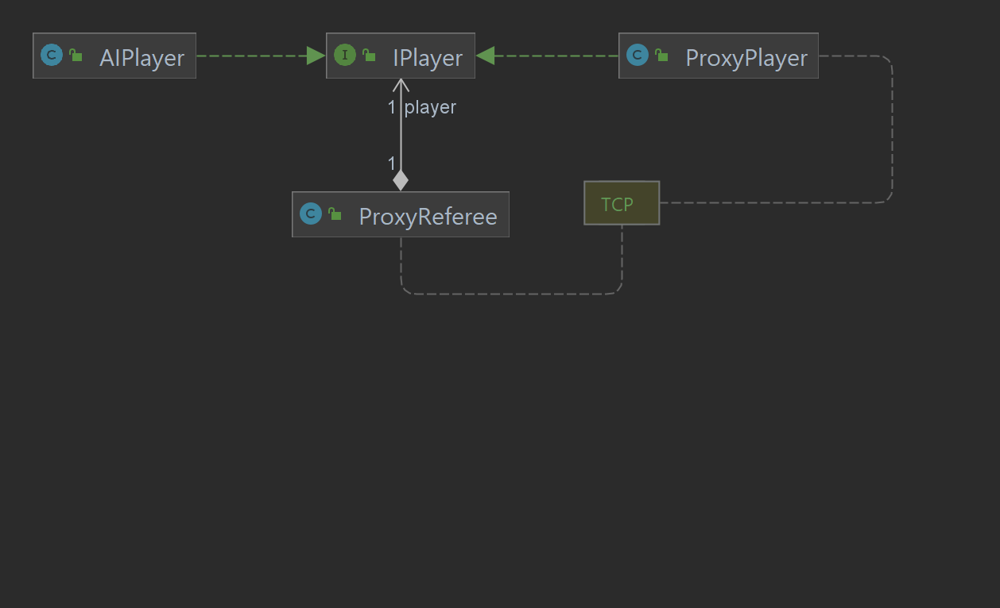

## Example: TakeTurn

### Proxy Player

--------------------------
Flow of Execution:

- IPublicState -> JSON Array -> TCP
- TCP -> JSON Element -> Adapter -> Optional(Action)

### Proxy Referee

-----------------------------

Flow of Execution:

- TCP -> JSON Array -> JSON Element -> adapter -> IPublicState

**(At this point throwing an error in state construction could result in a player being kicked out)**

**Client performs an action**

- Optional(Action) -> JSON Array -> TCP

