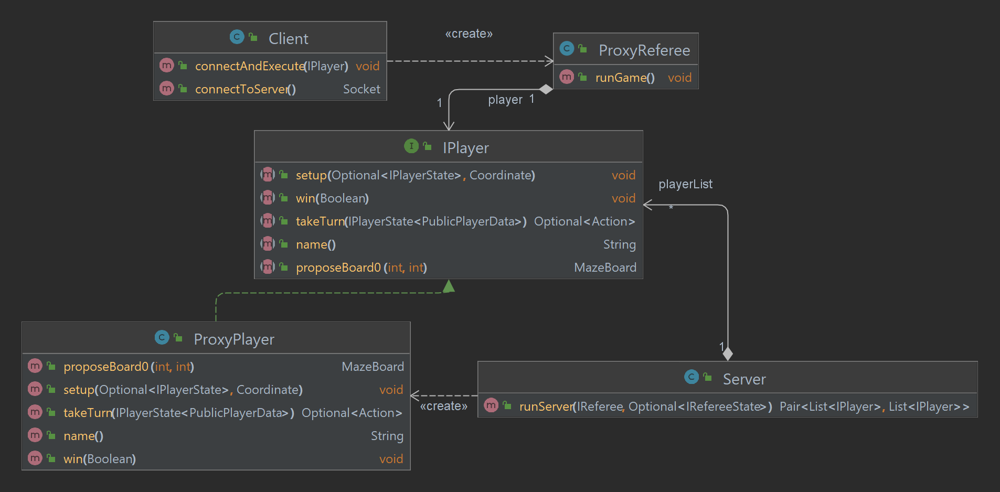

# REQUIREMENTS

A daemon thread is created for each client connection

The referee game is ran on the main thread

### Server

------------

- Minimum two players to run a game
- Maximum of six players to run a game
- 2 Waiting periods of 20 seconds.
- 2 second name response time for an accepted client

### Client

-------------------

- Single client must be able to run multiple sign-ups
    - For loop

