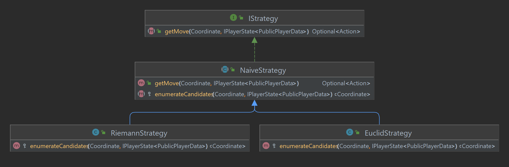

## Strategy

A IStrategy has one required method, getMove that returns an IPlayerState with the executed move.

The naive strategy abstracts from shared functionality of its implementations to look for the first viable action to 
reach a tile from a list of candidates tiles.

The Riemann strategy enumerates based all tiles coordinates in row-column order, starting from the top-most

The Euclid strategy enumerates based on Euclidean distance.

